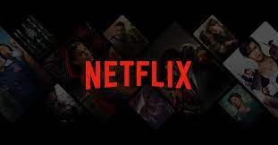
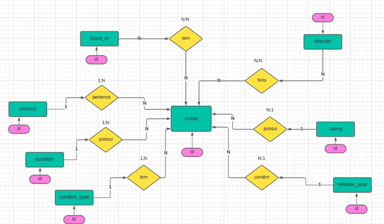
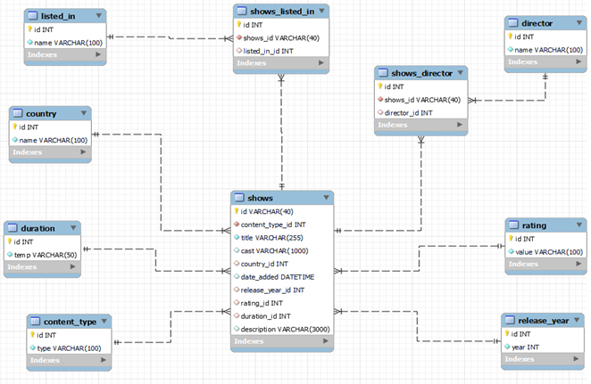

# CoderHouse - Projeto SQL

## Índice

- [1. Tema do Projeto](#1-tema-do-projeto)
- [2. Diagrama Entidade Relacionamento](#2-diagrama-entidade-relacionamento)
- [3. Descrição de tabelas](#3-descrição-de-tabelas)

## 1. Tema do Projeto

O tema para desenvolvimento deste projeto é a plataforma de streaming Netflix, que foi fundada por Reed Hastings e Marc Randolph, em 1997. O projeto inicial da empresa tem origem na ideia de alugar DVDs, pelo correio. Sendo assim, um ano depois, foi lançado o site da companhia, para cumprir esse objetivo. Em 1999 estreou um tipo de serviço de assinatura e, com isso, os DVDs poderiam ser alugados sem um limite mensal ou multa por atraso.

Atualmente, a Netflix oferece o streaming de vídeo — o que permite o acesso instantâneo a filmes, séries, documentários, shows e animações presentes no catálogo. O serviço está disponível em 190 países e em mais de 30 idiomas. Com isso, a somatória de assinantes pelo mundo é de cerca de 200 milhões, segundo a plataforma.

A Netflix tem uma base muito abrangente de filmes e programas de tv disponível na plataforma, juntamente com os detalhes de elenco, diretores, classificação etc. O que faz ter uma gama de dados para serem trabalhados e pesquisados na hora do desenvolvimento dos nossos scripts.

## 2. Diagrama Entidade Relacionamento

Diagrama do banco de dados descreve como será relacionado os dados do projeto.

## 3. Descrição de Tabelas

Descreve a estrutura de tabelas com suas colunas e tipo de dados que serão utilizados.

## 6. Autoria

Este projeto foi feito por [Mariana M Barros](https://github.com/MarianaMBarros) e [Pedro Henrique De Sousa Da Silva](),
com base nos aprendizados desenvolvido ao longo do curso da [CoderHouse](https://www.coderhouse.com.br/).
